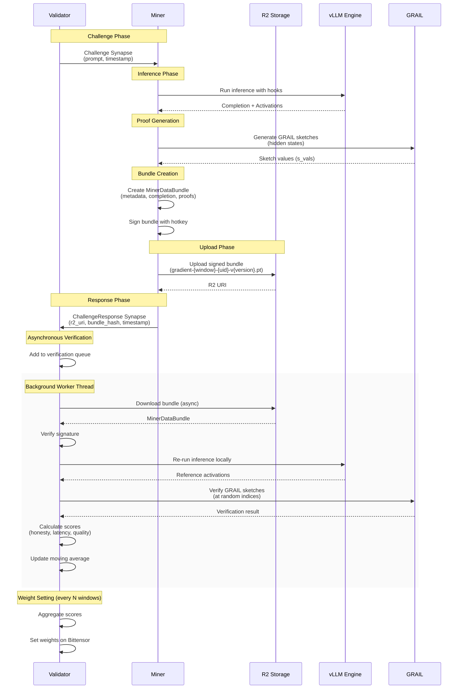
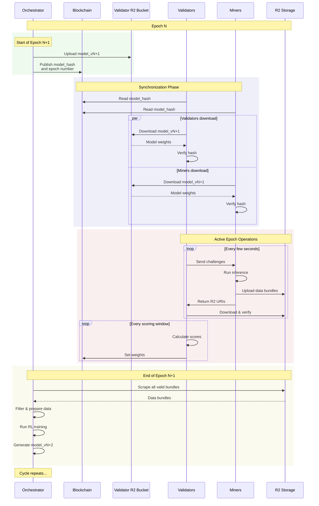

## **Technical Specification: GRAIL (v2.2 - Final)**

**Document Version:** 1.2
**Date:** July 28, 2025
**Status:** Final

### **1. Overview & Goals**

**Objective:** GRAIL is a Bittensor subnet that leverages a decentralized network of miners for massively parallel LLM inference and data generation, which is then consumed by a centralized orchestrator for Reinforcement Learning.

**Core Principles:**
1.  **Trustless Verification:** All miner contributions must be verifiable. We will use the GRAIL proof system to create cryptographic proofs of honest inference.
2.  **Competitive Incentives:** The reward mechanism must be competitive, creating a "Dirac delta" payoff function. Rewards will be sharply concentrated around the optimal strategy: being **honest, fast, and high-quality**.
3.  **Performance:** The entire system must be high-performance. Both miners and validators will utilize a modified version of **vLLM** for optimized inference.

### **2. Core Components & Technology**

*   **Miners:** Nodes that run inference on the current model, generate completions and GRAIL proofs (sketch values), and upload them to their own R2 buckets.
*   **Validators:** Nodes that audit miners by sending them challenge prompts, verifying their GRAIL proofs, and scoring them on performance and quality.
*   **Orchestrator (Subnet Owner):** A centralized, off-chain entity responsible for RL training and publishing new model versions.
*   **Technology Stack:**
    *   **Bittensor:** For network registration, peer discovery (metagraph), and incentive/reward propagation.
    *   **vLLM (with modifications):** The inference engine for both miners and validators.
    *   **GRAIL System:** For generating and verifying sketch-based proofs of honest computation.
    *   **R2 Object Storage:** Decentralized storage where each participant (miners, validators, orchestrator) has their own bucket.

### **3. System Architecture & Data Flow**

#### **3.1. Architecture Overview**

```mermaid
graph TB
    subgraph "Bittensor Network"
        BC[Blockchain]
        MG[Metagraph]
    end
    
    subgraph "Storage Layer"
        R2M[Miner R2 Buckets<br/>Data Bundles]
        R2V[Validator R2 Buckets<br/>Model Weights & Checkpoints]
        R2O[Orchestrator R2 Bucket<br/>Aggregated Data]
    end
    
    subgraph "Network Participants"
        O[Orchestrator<br/>RL Training]
        V1[Validator 1]
        V2[Validator 2]
        Vn[Validator N]
        M1[Miner 1]
        M2[Miner 2]
        Mn[Miner N]
    end
    
    subgraph "Core Technologies"
        VLLM[vLLM Engine<br/>+ Custom Worker]
        GRAIL[GRAIL System<br/>Sketch-based Proofs]
    end
    
    %% Orchestrator connections
    O -->|Publishes model_hash| BC
    O -->|Uploads model_vN| R2V
    O -->|Scrapes data| R2M
    
    %% Validator connections
    V1 & V2 & Vn -->|Set weights| BC
    V1 & V2 & Vn -->|Read model_hash| BC
    V1 & V2 & Vn -->|Download model| R2V
    V1 & V2 & Vn -->|Challenge| M1 & M2 & Mn
    V1 & V2 & Vn -->|Download bundles| R2M
    V1 & V2 & Vn -.->|Uses| VLLM
    V1 & V2 & Vn -.->|Verifies with| GRAIL
    V1 & V2 & Vn -->|Store checkpoints| R2V
    
    %% Miner connections
    M1 & M2 & Mn -->|Read model_hash| BC
    M1 & M2 & Mn -->|Download model| R2V
    M1 & M2 & Mn -->|Upload bundles| R2M
    M1 & M2 & Mn -.->|Uses| VLLM
    M1 & M2 & Mn -.->|Generates proofs| GRAIL
    M1 & M2 & Mn -->|Publish bucket info| BC
    
    %% Network discovery
    BC -->|Peer discovery| MG
    MG -.->|Network info| V1 & V2 & Vn & M1 & M2 & Mn
    
    style O fill:#f9f,stroke:#333,stroke-width:4px
    style BC fill:#bbf,stroke:#333,stroke-width:2px
    style R2M fill:#bfb,stroke:#333,stroke-width:2px
    style R2V fill:#fbf,stroke:#333,stroke-width:2px
    style R2O fill:#ffb,stroke:#333,stroke-width:2px
```



The system operates in **Epochs**, long periods (e.g., 12-24 hours) corresponding to a single model version. Epochs are subdivided into **Windows**, short, fixed intervals of blockchain blocks (e.g., 100 blocks, ~3 minutes) used for synchronization and scoring.

1.  **Epoch Start:** The Orchestrator uploads `model_vN` to the highest-stake validator's R2 bucket and publishes its `model_hash` to the blockchain.
2.  **Synchronization:** All miners and validators download and verify the new model from the validator's R2 bucket.
3.  **Challenge-Response Loop (Continuous):**
    *   A validator selects a miner and sends a timestamped `Challenge` Synapse containing a unique `prompt`.
    *   The miner performs inference, generates GRAIL sketch values (s_vals), uploads a signed `MinerDataBundle` to their own R2 bucket using epoch-window naming (e.g., `gradient-{window}-{uid}-v{version}.pt`), and immediately returns a `ChallengeResponse` Synapse with the R2 URI.
4.  **Asynchronous Verification:** The validator adds the miner's response to a background queue. A worker thread downloads the bundle from the miner's R2 bucket, re-runs inference locally to get reference hidden states, and performs GRAIL verification by checking sketch values at random indices and performance scoring.
5.  **Weight Setting:** At the end of every scoring window (a set number of blockchain windows), the validator aggregates the scores, updates its moving averages for each miner, and sets its weights on the Bittensor network.
6.  **Epoch End:** The Orchestrator accesses each miner's R2 bucket to scrape all valid data bundles for the epoch windows, performs its RL training, and publishes `model_vN+1`, starting the next epoch.

#### **3.2. Challenge-Response Sequence**



#### **3.3. Epoch Lifecycle Sequence**



### **4. Data Schemas & Synapses**

**File:** `src/grail/schemas.py`

```python
import bittensor as bt
from pydantic import BaseModel, Field
from typing import List, Optional, Dict, Any

# --------------------------------------------------
# Bucket Configuration Schema
# --------------------------------------------------

class Bucket(BaseModel):
    """R2 bucket configuration"""
    name: str
    account_id: str
    access_key_id: str
    secret_access_key: str

# --------------------------------------------------
# Bittensor Synapse Definitions
# --------------------------------------------------

class Challenge(bt.Synapse):
    """
    Synapse sent from a Validator to a Miner.
    Contains the prompt, randomness for GRAIL sketch generation, and a timestamp for latency calculation.
    """
    prompt: str = Field(..., description="The prompt for the miner to run inference on.")
    randomness: str = Field(..., description="Hex randomness for GRAIL sketch vector generation.")
    timestamp: float = Field(..., description="Timestamp (time.time()) of when the validator sent the request.")
    window: int = Field(..., description="Current window number for data organization.")

class ChallengeResponse(bt.Synapse):
    """
    Synapse sent from a Miner back to a Validator.
    Contains pointers to the generated data, not the data itself.
    """
    r2_uri: str = Field(..., description="The URI of the data bundle in the miner's R2 bucket.")
    bundle_hash: str = Field(..., description="SHA256 hash of the JSON bundle content for integrity verification.")
    timestamp: float = Field(..., description="Timestamp (time.time()) of when the miner finished processing.")
    window: int = Field(..., description="Window number when the data was generated.")
    
    required_hash_fields: List[str] = ["r2_uri", "bundle_hash", "timestamp", "window"]

# --------------------------------------------------
# R2 Data Bundle Schema
# --------------------------------------------------

class MinerDataBundle(BaseModel):
    """
    The data structure miners upload to R2 and validators download for verification.
    Filename format: gradient-{window}-{uid}-v{version}.pt
    """
    class Metadata(BaseModel):
        miner_hotkey: str
        model_hash: str
        epoch: int
        window: int
        timestamp_utc: str
        version: str

    metadata: Metadata
    prompt: str
    completion: str
    grail_commitment: Dict[str, Any]  # GRAIL commitment containing tokens, s_vals, signature
    signature: str           # Signature of the (metadata, prompt, completion) tuple with the miner's hotkey
    
# --------------------------------------------------
# Blockchain Commitment Schema
# --------------------------------------------------

class BucketCommitment(BaseModel):
    """Information miners commit to the blockchain about their R2 buckets"""
    bucket_name: str
    account_id: str
    access_key_id: str  # Read-only access key for validators
    epoch: int
    window: int
```

### **5. Incentive Mechanism & Scoring Logic**

The final score for a miner's work is a composite of honesty, latency, and quality.

`Final Score = Score_honesty * (w_latency * Score_latency + w_quality * Score_quality)`

*   **`Score_honesty` (Binary Gate):** 1 if GRAIL sketch verification passes within tolerance (±3), 0 otherwise. If 0, the final score is 0.
*   **`Score_latency` (0-1):** A sigmoid function of the round-trip time.
*   **`Score_quality` (0-1):** The miner's average log-probability for their completion, normalized relative to other miners in the same scoring window.
*   **`Weight`:** A moving average of a miner's `Final_Score` over time, providing stability.

**File:** `src/grail/metrics.py`
```python
import math
from typing import Dict

def calculate_latency_score(latency: float, target_latency: float, steepness: float) -> float:
    return 1.0 / (1.0 + math.exp(steepness * (latency - target_latency)))

def normalize_quality_scores(log_prob_scores: Dict[str, float]) -> Dict[str, float]:
    if not log_prob_scores or len(log_prob_scores) < 2:
        return {hk: 1.0 for hk in log_prob_scores}

    min_lp = min(log_prob_scores.values())
    max_lp = max(log_prob_scores.values())
    
    if max_lp == min_lp:
        return {hk: 1.0 for hk in log_prob_scores}

    return {hk: (lp - min_lp) / (max_lp - min_lp) for hk, lp in log_prob_scores.items()}
```

### **6. Implementation Details & Code Skeletons**

#### **6.1. File Structure (Proposed)**

```
grail/
├── neurons/
│   ├── base_node.py
│   ├── miner.py
│   └── validator.py
└── src/
    └── grail/
        ├── config.py
        ├── metrics.py
        ├── schemas.py
        └── vllm_interop.py
```

#### **6.2. GRAIL Integration with vLLM**

**File:** `src/grail/vllm_interop.py`
With GRAIL, we can use standard vLLM without complex activation hooking.

```python
from vllm import AsyncLLMEngine, LLM
from vllm.engine.arg_utils import AsyncEngineArgs
from transformers import AutoModelForCausalLM, AutoTokenizer
import torch
import hashlib
import struct
from typing import List, Dict, Any
import grail.grail as grail

class GRAILInferenceEngine:
    """Wrapper for vLLM that integrates GRAIL proof generation."""
    
    def __init__(self, model_name: str, device: str = "cuda"):
        self.model_name = model_name
        self.device = device
        self.llm = LLM(model=model_name)
        self.tokenizer = AutoTokenizer.from_pretrained(model_name)
        
        # Initialize GRAIL components
        self.prover = grail.Prover(model_name)
        
    async def generate_with_proof(self, prompt: str, randomness: str, max_tokens: int = 32) -> Dict[str, Any]:
        """
        Generate text with GRAIL proof.
        Returns both the generated text and the GRAIL commitment.
        """
        # Use GRAIL prover for generation and commitment
        commitment = self.prover.commit(prompt, randomness, max_tokens)
        
        # Extract generated text
        tokens = commitment["tokens"]
        generated_text = self.tokenizer.decode(tokens, skip_special_tokens=True)
        
        return {
            "generated_text": generated_text,
            "tokens": tokens,
            "grail_commitment": {
                "s_vals": commitment["s_vals"],
                "signature": commitment["signature"],
                "model_hash": commitment["model_hash"]
            },
            "randomness": randomness
        }
    
    def prepare_challenge_response(self, tokens: List[int], challenge_randomness: str, k: int = 16) -> Dict[str, Any]:
        """
        Prepare response to a validator's challenge.
        """
        indices = grail.indices_from_root(tokens, challenge_randomness, len(tokens), k)
        return {
            "challenge_randomness": challenge_randomness,
            "indices": indices
        }

def create_grail_engine(model_name: str, **kwargs) -> GRAILInferenceEngine:
    """Factory function to create a GRAIL-enabled inference engine."""
    return GRAILInferenceEngine(model_name, **kwargs)
```

### **7. Configuration**

**File:** `src/grail/config.py`

```python
from types import SimpleNamespace
import os

# R2 Bucket Configuration (from environment variables)
BUCKET_SECRETS = {
    "gradients": {
        "name": os.environ.get("R2_GRADIENTS_BUCKET_NAME"),
        "account_id": os.environ.get("R2_ACCOUNT_ID"),
        "credentials": {
            "read": {
                "access_key_id": os.environ.get("R2_GRADIENTS_READ_ACCESS_KEY"),
                "secret_access_key": os.environ.get("R2_GRADIENTS_READ_SECRET_KEY"),
            },
            "write": {
                "access_key_id": os.environ.get("R2_GRADIENTS_WRITE_ACCESS_KEY"),
                "secret_access_key": os.environ.get("R2_GRADIENTS_WRITE_SECRET_KEY"),
            }
        }
    },
    "models": {
        "name": os.environ.get("R2_MODELS_BUCKET_NAME"),
        "account_id": os.environ.get("R2_ACCOUNT_ID"),
        "credentials": {
            "read": {
                "access_key_id": os.environ.get("R2_MODELS_READ_ACCESS_KEY"),
                "secret_access_key": os.environ.get("R2_MODELS_READ_SECRET_KEY"),
            },
            "write": {
                "access_key_id": os.environ.get("R2_MODELS_WRITE_ACCESS_KEY"),
                "secret_access_key": os.environ.get("R2_MODELS_WRITE_SECRET_KEY"),
            }
        }
    }
}

HPARAMS = SimpleNamespace(
    # Subnet UID
    netuid=...,
    
    # Windowing & Epochs
    blocks_per_window=100,      # Approx. 3 minutes
    scoring_window_size=10,     # Score and set weights every 10 windows (~30 mins)
    windows_per_epoch=240,      # ~12 hours per model version
    
    # GRAIL Parameters
    grail_layer_index=-1,  # Last layer by default
    grail_challenge_k=16,  # Number of indices to verify
    grail_tolerance=3,  # Maximum allowed difference in sketch values
    grail_prime_q=2147483647,  # Modulus for sketch computation
    grail_scaling_factor=1024,  # Scaling factor for hidden states
    
    # Incentive Weights
    w_latency=0.3,
    w_quality=0.7,
    
    # Latency Scoring Parameters
    latency_target=2.5, # seconds
    latency_steepness=2.0,
    
    # Moving Average
    score_alpha=0.1,
    
    # Storage Configuration
    stale_retention=10,  # Windows to keep before cleanup
    checkpoint_keep_last=3,  # Number of checkpoints to retain
    
    # File Naming Convention
    gradient_filename_format="gradient-{window}-{uid}-v{version}.pt",
    checkpoint_filename_format="checkpoint-{window}-{uid}-v{version}.pt",
    model_filename_format="model-{epoch}-v{version}.pt",
)
```

### **8. R2 Bucket Access Patterns**

#### **8.1. Decentralized Storage Architecture**

Each participant in the subnet maintains their own R2 bucket:

1. **Miners:**
   - Own bucket for uploading gradient data bundles
   - Naming: `gradient-{window}-{uid}-v{version}.pt`
   - Publish read-only credentials to blockchain for validators to access

2. **Validators:**
   - Own bucket for storing model weights and checkpoints
   - Highest-stake validator's bucket becomes the authoritative source for model downloads
   - Store: models, checkpoints, peer lists, start windows

3. **Orchestrator:**
   - Accesses miner buckets directly to scrape gradient data
   - Uploads new models to highest-stake validator's bucket

#### **8.2. Key Access Patterns**

```python
# Miner uploads gradient
filename = f"gradient-{window}-{uid}-v{version}.pt"
await comms.s3_put_object(filename, file_path, miner_bucket)

# Validator downloads from miner
bucket = commitments.get(miner_uid)  # Get miner's bucket from blockchain
gradient = await comms.s3_get_object(filename, bucket)

# All participants download model from validator
validator_bucket = await comms._get_highest_stake_validator_bucket()
model = await comms.s3_get_object(f"model-{epoch}-v{version}.pt", validator_bucket)
```

#### **8.3. Data Lifecycle**

- **Gradient files:** Named by window, automatically cleaned up after `stale_retention` windows
- **Model files:** Named by epoch, retained for entire epoch duration
- **Checkpoints:** Keep last N checkpoints, older ones automatically deleted

### **9. Security Analysis: GRAIL vs toploc**

#### **9.1. Improvements with GRAIL**

1. **Reduced Data Transmission**: GRAIL only requires transmitting integer sketch values (s_vals) instead of full activation tensors, significantly reducing bandwidth requirements.

2. **Enhanced Privacy**: The sketch-based approach doesn't reveal actual activation values, only their projections onto a random vector modulo a prime.

3. **Deterministic Randomness**: GRAIL uses cryptographic PRFs for generating random vectors and selecting indices, ensuring reproducibility and preventing manipulation.

4. **Integrity Protection**: HMAC signatures on sketch values prevent tampering and ensure data authenticity.

5. **Simplified Implementation**: GRAIL doesn't require custom vLLM modifications for capturing specific layer activations - it can work with standard model outputs.

#### **9.2. Trade-offs and Considerations**

1. **Statistical Security**: GRAIL checks only K=16 random positions rather than all positions, providing statistical rather than deterministic security. The security level is 1 - (1/2^K) for random errors.

2. **Single Layer Focus**: GRAIL typically uses one layer (e.g., the last hidden layer) while toploc was designed for multiple layer verification. This could be extended if needed.

3. **Tolerance Handling**: GRAIL uses a fixed tolerance of ±3 for modular arithmetic differences, which may need tuning based on model precision requirements.

4. **Challenge-Response Protocol**: GRAIL requires a two-phase commit-reveal protocol with external randomness, adding slight complexity to the interaction flow.

#### **9.3. Implementation Changes**

The key changes when replacing toploc with GRAIL:

1. **Miner Side**: 
   - Generate sketch values during inference
   - Store commitment with tokens and s_vals
   - Respond to challenges with selected indices

2. **Validator Side**:
   - Provide randomness for sketch generation
   - Verify only at challenged positions
   - Check modular arithmetic tolerance

3. **Data Storage**:
   - Store GRAIL commitments instead of activation proofs
   - Reduced storage requirements (integers vs tensors)

### **10. Development Roadmap**

1.  **Phase 1: GRAIL Integration & Foundational Setup**
    *   **Deliverable:** A functional GRAIL-enabled inference engine and verification system.
    *   **Tasks:** Integrate GRAIL proof generation with vLLM inference. Set up the `BaseNode` with the block listener. Create basic Miner/Validator classes that use GRAIL for verification.

2.  **Phase 2: Core Protocol Implementation**
    *   **Deliverable:** A functional subnet where validators can challenge miners, and miners can respond with R2 URIs.
    *   **Tasks:** Implement the `Challenge` and `ChallengeResponse` synapses. Implement the miner's `forward` function (inference, bundle creation, R2 upload). Implement the validator's `forward` function and its asynchronous verification queue.

3.  **Phase 3: Honesty & Performance Layers** 
    *   **Deliverable:** A fully functional scoring system.
    *   **Tasks:** Integrate GRAIL for sketch generation and verification. Implement the `Score_honesty` gate based on sketch verification. Implement `Score_latency` and `Score_quality` metrics and normalization. Implement the moving average logic and the `set_weights` call.

4.  **Phase 4: Orchestrator & Deployment** (Ongoing)
    *   **Deliverable:** A live subnet on the Bittensor testnet.
    *   **Tasks:** Develop the off-chain Orchestrator to scrape R2 and run RL training. Implement the on-chain mechanism for announcing new model hashes. Rigorous testing and deployment.