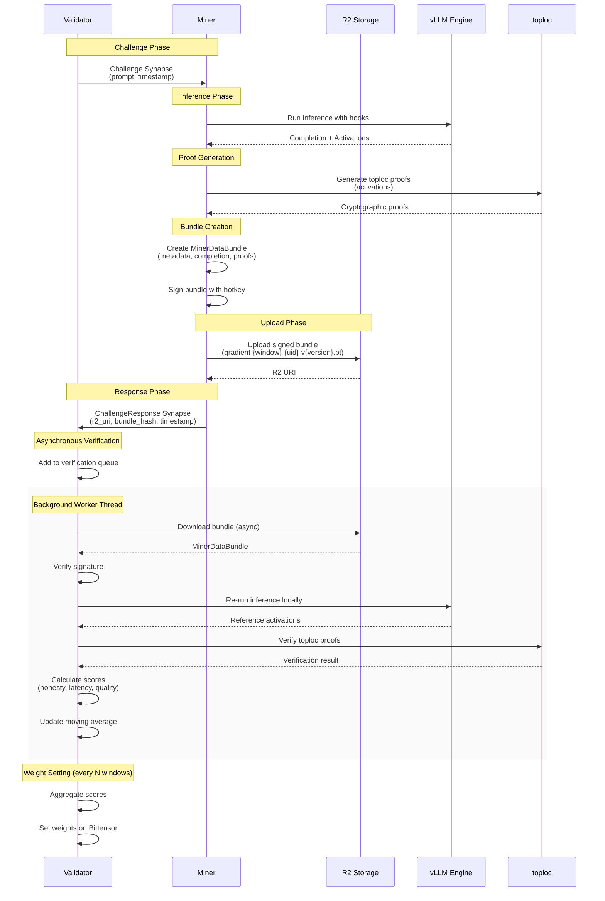
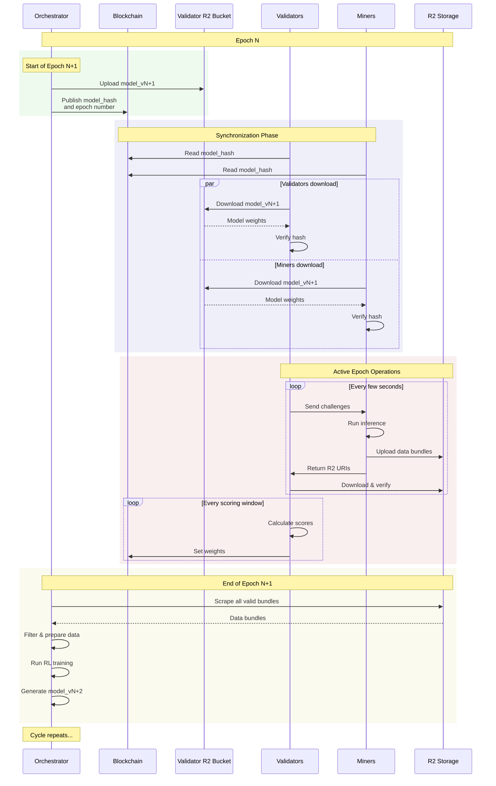

Of course. Here is the full technical specification with the "Design Rationale" section removed as requested.

---

## **Technical Specification: Thronos (v2.2 - Final)**

**Document Version:** 1.2
**Date:** July 28, 2025
**Status:** Final

### **1. Overview & Goals**

**Objective:** Thronos is a Bittensor subnet that leverages a decentralized network of miners for massively parallel LLM inference and data generation, which is then consumed by a centralized orchestrator for Reinforcement Learning.

**Core Principles:**
1.  **Trustless Verification:** All miner contributions must be verifiable. We will use the `toploc` library to create cryptographic proofs of honest inference.
2.  **Competitive Incentives:** The reward mechanism must be competitive, creating a "Dirac delta" payoff function. Rewards will be sharply concentrated around the optimal strategy: being **honest, fast, and high-quality**.
3.  **Performance:** The entire system must be high-performance. Both miners and validators will utilize a modified version of **vLLM** for optimized inference.

### **2. Core Components & Technology**

*   **Miners:** Nodes that run inference on the current model, generate completions and `toploc` proofs, and upload them to their own R2 buckets.
*   **Validators:** Nodes that audit miners by sending them challenge prompts, verifying their `toploc` proofs, and scoring them on performance and quality.
*   **Orchestrator (Subnet Owner):** A centralized, off-chain entity responsible for RL training and publishing new model versions.
*   **Technology Stack:**
    *   **Bittensor:** For network registration, peer discovery (metagraph), and incentive/reward propagation.
    *   **vLLM (with modifications):** The inference engine for both miners and validators.
    *   **`toploc` Library:** For generating and verifying proofs of honest computation.
    *   **R2 Object Storage:** Decentralized storage where each participant (miners, validators, orchestrator) has their own bucket.

### **3. System Architecture & Data Flow**

#### **3.1. Architecture Overview**

```mermaid
graph TB
    subgraph "Bittensor Network"
        BC[Blockchain]
        MG[Metagraph]
    end
    
    subgraph "Storage Layer"
        R2M[Miner R2 Buckets<br/>Data Bundles]
        R2V[Validator R2 Buckets<br/>Model Weights & Checkpoints]
        R2O[Orchestrator R2 Bucket<br/>Aggregated Data]
    end
    
    subgraph "Network Participants"
        O[Orchestrator<br/>RL Training]
        V1[Validator 1]
        V2[Validator 2]
        Vn[Validator N]
        M1[Miner 1]
        M2[Miner 2]
        Mn[Miner N]
    end
    
    subgraph "Core Technologies"
        VLLM[vLLM Engine<br/>+ Custom Worker]
        TOPLOC[toploc Library<br/>Proof System]
    end
    
    %% Orchestrator connections
    O -->|Publishes model_hash| BC
    O -->|Uploads model_vN| R2V
    O -->|Scrapes data| R2M
    
    %% Validator connections
    V1 & V2 & Vn -->|Set weights| BC
    V1 & V2 & Vn -->|Read model_hash| BC
    V1 & V2 & Vn -->|Download model| R2V
    V1 & V2 & Vn -->|Challenge| M1 & M2 & Mn
    V1 & V2 & Vn -->|Download bundles| R2M
    V1 & V2 & Vn -.->|Uses| VLLM
    V1 & V2 & Vn -.->|Verifies with| TOPLOC
    V1 & V2 & Vn -->|Store checkpoints| R2V
    
    %% Miner connections
    M1 & M2 & Mn -->|Read model_hash| BC
    M1 & M2 & Mn -->|Download model| R2V
    M1 & M2 & Mn -->|Upload bundles| R2M
    M1 & M2 & Mn -.->|Uses| VLLM
    M1 & M2 & Mn -.->|Generates proofs| TOPLOC
    M1 & M2 & Mn -->|Publish bucket info| BC
    
    %% Network discovery
    BC -->|Peer discovery| MG
    MG -.->|Network info| V1 & V2 & Vn & M1 & M2 & Mn
    
    style O fill:#f9f,stroke:#333,stroke-width:4px
    style BC fill:#bbf,stroke:#333,stroke-width:2px
    style R2M fill:#bfb,stroke:#333,stroke-width:2px
    style R2V fill:#fbf,stroke:#333,stroke-width:2px
    style R2O fill:#ffb,stroke:#333,stroke-width:2px
```



The system operates in **Epochs**, long periods (e.g., 12-24 hours) corresponding to a single model version. Epochs are subdivided into **Windows**, short, fixed intervals of blockchain blocks (e.g., 100 blocks, ~3 minutes) used for synchronization and scoring.

1.  **Epoch Start:** The Orchestrator uploads `model_vN` to the highest-stake validator's R2 bucket and publishes its `model_hash` to the blockchain.
2.  **Synchronization:** All miners and validators download and verify the new model from the validator's R2 bucket.
3.  **Challenge-Response Loop (Continuous):**
    *   A validator selects a miner and sends a timestamped `Challenge` Synapse containing a unique `prompt`.
    *   The miner performs inference, generates `toploc` proofs, uploads a signed `MinerDataBundle` to their own R2 bucket using epoch-window naming (e.g., `gradient-{window}-{uid}-v{version}.pt`), and immediately returns a `ChallengeResponse` Synapse with the R2 URI.
4.  **Asynchronous Verification:** The validator adds the miner's response to a background queue. A worker thread downloads the bundle from the miner's R2 bucket, re-runs inference locally to get reference activations, and performs `toploc` verification and performance scoring.
5.  **Weight Setting:** At the end of every scoring window (a set number of blockchain windows), the validator aggregates the scores, updates its moving averages for each miner, and sets its weights on the Bittensor network.
6.  **Epoch End:** The Orchestrator accesses each miner's R2 bucket to scrape all valid data bundles for the epoch windows, performs its RL training, and publishes `model_vN+1`, starting the next epoch.

#### **3.2. Challenge-Response Sequence**



#### **3.3. Epoch Lifecycle Sequence**



### **4. Data Schemas & Synapses**

**File:** `src/thronos/schemas.py`

```python
import bittensor as bt
from pydantic import BaseModel, Field
from typing import List, Optional

# --------------------------------------------------
# Bucket Configuration Schema
# --------------------------------------------------

class Bucket(BaseModel):
    """R2 bucket configuration"""
    name: str
    account_id: str
    access_key_id: str
    secret_access_key: str

# --------------------------------------------------
# Bittensor Synapse Definitions
# --------------------------------------------------

class Challenge(bt.Synapse):
    """
    Synapse sent from a Validator to a Miner.
    Contains the prompt and a timestamp for latency calculation.
    """
    prompt: str = Field(..., description="The prompt for the miner to run inference on.")
    timestamp: float = Field(..., description="Timestamp (time.time()) of when the validator sent the request.")
    window: int = Field(..., description="Current window number for data organization.")

class ChallengeResponse(bt.Synapse):
    """
    Synapse sent from a Miner back to a Validator.
    Contains pointers to the generated data, not the data itself.
    """
    r2_uri: str = Field(..., description="The URI of the data bundle in the miner's R2 bucket.")
    bundle_hash: str = Field(..., description="SHA256 hash of the JSON bundle content for integrity verification.")
    timestamp: float = Field(..., description="Timestamp (time.time()) of when the miner finished processing.")
    window: int = Field(..., description="Window number when the data was generated.")
    
    required_hash_fields: List[str] = ["r2_uri", "bundle_hash", "timestamp", "window"]

# --------------------------------------------------
# R2 Data Bundle Schema
# --------------------------------------------------

class MinerDataBundle(BaseModel):
    """
    The data structure miners upload to R2 and validators download for verification.
    Filename format: gradient-{window}-{uid}-v{version}.pt
    """
    class Metadata(BaseModel):
        miner_hotkey: str
        model_hash: str
        epoch: int
        window: int
        timestamp_utc: str
        version: str

    metadata: Metadata
    prompt: str
    completion: str
    toploc_proofs: List[str]  # List of base64 encoded toploc proofs
    signature: str           # Signature of the (metadata, prompt, completion) tuple with the miner's hotkey
    
# --------------------------------------------------
# Blockchain Commitment Schema
# --------------------------------------------------

class BucketCommitment(BaseModel):
    """Information miners commit to the blockchain about their R2 buckets"""
    bucket_name: str
    account_id: str
    access_key_id: str  # Read-only access key for validators
    epoch: int
    window: int
```

### **5. Incentive Mechanism & Scoring Logic**

The final score for a miner's work is a composite of honesty, latency, and quality.

`Final Score = Score_honesty * (w_latency * Score_latency + w_quality * Score_quality)`

*   **`Score_honesty` (Binary Gate):** 1 if `toploc` verification passes within tolerance, 0 otherwise. If 0, the final score is 0.
*   **`Score_latency` (0-1):** A sigmoid function of the round-trip time.
*   **`Score_quality` (0-1):** The miner's average log-probability for their completion, normalized relative to other miners in the same scoring window.
*   **`Weight`:** A moving average of a miner's `Final_Score` over time, providing stability.

**File:** `src/thronos/metrics.py`
```python
import math
from typing import Dict

def calculate_latency_score(latency: float, target_latency: float, steepness: float) -> float:
    return 1.0 / (1.0 + math.exp(steepness * (latency - target_latency)))

def normalize_quality_scores(log_prob_scores: Dict[str, float]) -> Dict[str, float]:
    if not log_prob_scores or len(log_prob_scores) < 2:
        return {hk: 1.0 for hk in log_prob_scores}

    min_lp = min(log_prob_scores.values())
    max_lp = max(log_prob_scores.values())
    
    if max_lp == min_lp:
        return {hk: 1.0 for hk in log_prob_scores}

    return {hk: (lp - min_lp) / (max_lp - min_lp) for hk, lp in log_prob_scores.items()}
```

### **6. Implementation Details & Code Skeletons**

#### **6.1. File Structure (Proposed)**

```
thronos/
├── neurons/
│   ├── base_node.py
│   ├── miner.py
│   └── validator.py
└── src/
    └── thronos/
        ├── config.py
        ├── metrics.py
        ├── schemas.py
        └── vllm_interop.py
```

#### **6.2. vLLM Activation Hooking: The Custom Worker**

**File:** `src/thronos/vllm_interop.py`
This is the most critical engineering task.

```python
from vllm import AsyncLLMEngine
from vllm.engine.arg_utils import AsyncEngineArgs
from vllm.worker.worker import Worker
from vllm.sequence import SamplerOutput, SequenceGroupMetadata
from typing import List, Dict
import torch

class ActivationHookingWorker(Worker):
    """A custom vLLM Worker that hooks into transformer layers to capture activations."""
    def __init__(self, *args, layers_to_hook: List[int] = None, **kwargs):
        super().__init__(*args, **kwargs)
        self.layers_to_hook = layers_to_hook if layers_to_hook is not None else []
        self.activation_store: Dict[str, List[torch.Tensor]] = {}

        if self.layers_to_hook:
            self._add_hooks()
            print(f"[ActivationHookingWorker] Hooks successfully added for layers: {self.layers_to_hook}")

    def _add_hooks(self):
        model_layers = self.model_runner.model.model.layers
        for layer_idx in self.layers_to_hook:
            if 0 <= layer_idx < len(model_layers):
                model_layers[layer_idx].register_forward_hook(self._create_hook_fn(layer_idx))
            else:
                print(f"[ActivationHookingWorker] ERROR: Layer index {layer_idx} is out of bounds.")

    def _create_hook_fn(self, layer_idx: int):
        def hook(module, input, output):
            seq_group_metadata_list = getattr(self, "_current_seq_group_metadata", [])
            batch_hidden_states = output[0] # MUST be verified for the model architecture
            
            for seq_group in seq_group_metadata_list:
                req_id = seq_group.request_id
                # CRITICAL TASK: Implement the logic to map sequence data to batch rows.
                row_indices = [seq.seq_id for seq in seq_group.get_seqs()]
                request_activations = batch_hidden_states[row_indices]
                self.activation_store[req_id].append(request_activations.detach().clone().cpu())
        return hook

    def execute_model(
        self, seq_group_metadata_list: List[SequenceGroupMetadata], **kwargs
    ) -> List[SamplerOutput]:
        self._current_seq_group_metadata = seq_group_metadata_list
        for seq_group in seq_group_metadata_list:
            if seq_group.request_id not in self.activation_store:
                self.activation_store[seq_group.request_id] = []
        
        try:
            sampler_output_list = super().execute_model(seq_group_metadata_list, **kwargs)
        finally:
            delattr(self, "_current_seq_group_metadata")

        for sampler_output in sampler_output_list:
            req_id = sampler_output.parent_seq_group.request_id
            sampler_output.captured_activations = self.activation_store.pop(req_id, [])
        
        return sampler_output_list

def create_vllm_engine(model_name: str, layers_to_hook: List[int], **engine_kwargs) -> AsyncLLMEngine:
    engine_args = AsyncEngineArgs(model=model_name, **engine_kwargs)
    engine_args.worker_class = "thronos.vllm_interop.ActivationHookingWorker"
    engine_args.extra_configs = {"layers_to_hook": layers_to_hook}
    return AsyncLLMEngine.from_engine_args(engine_args)
```

### **7. Configuration**

**File:** `src/thronos/config.py`

```python
from types import SimpleNamespace
import os

# R2 Bucket Configuration (from environment variables)
BUCKET_SECRETS = {
    "gradients": {
        "name": os.environ.get("R2_GRADIENTS_BUCKET_NAME"),
        "account_id": os.environ.get("R2_ACCOUNT_ID"),
        "credentials": {
            "read": {
                "access_key_id": os.environ.get("R2_GRADIENTS_READ_ACCESS_KEY"),
                "secret_access_key": os.environ.get("R2_GRADIENTS_READ_SECRET_KEY"),
            },
            "write": {
                "access_key_id": os.environ.get("R2_GRADIENTS_WRITE_ACCESS_KEY"),
                "secret_access_key": os.environ.get("R2_GRADIENTS_WRITE_SECRET_KEY"),
            }
        }
    },
    "models": {
        "name": os.environ.get("R2_MODELS_BUCKET_NAME"),
        "account_id": os.environ.get("R2_ACCOUNT_ID"),
        "credentials": {
            "read": {
                "access_key_id": os.environ.get("R2_MODELS_READ_ACCESS_KEY"),
                "secret_access_key": os.environ.get("R2_MODELS_READ_SECRET_KEY"),
            },
            "write": {
                "access_key_id": os.environ.get("R2_MODELS_WRITE_ACCESS_KEY"),
                "secret_access_key": os.environ.get("R2_MODELS_WRITE_SECRET_KEY"),
            }
        }
    }
}

HPARAMS = SimpleNamespace(
    # Subnet UID
    netuid=...,
    
    # Windowing & Epochs
    blocks_per_window=100,      # Approx. 3 minutes
    scoring_window_size=10,     # Score and set weights every 10 windows (~30 mins)
    windows_per_epoch=240,      # ~12 hours per model version
    
    # TOPLOC Parameters
    toploc_layers_to_hook=[6, 12, 18, 24],
    toploc_topk=128,
    toploc_decode_batching_size=32,
    toploc_exp_mismatch_tolerance=0,
    toploc_mant_error_tolerance=5.0,
    
    # Incentive Weights
    w_latency=0.3,
    w_quality=0.7,
    
    # Latency Scoring Parameters
    latency_target=2.5, # seconds
    latency_steepness=2.0,
    
    # Moving Average
    score_alpha=0.1,
    
    # Storage Configuration
    stale_retention=10,  # Windows to keep before cleanup
    checkpoint_keep_last=3,  # Number of checkpoints to retain
    
    # File Naming Convention
    gradient_filename_format="gradient-{window}-{uid}-v{version}.pt",
    checkpoint_filename_format="checkpoint-{window}-{uid}-v{version}.pt",
    model_filename_format="model-{epoch}-v{version}.pt",
)
```

### **8. R2 Bucket Access Patterns**

#### **8.1. Decentralized Storage Architecture**

Each participant in the subnet maintains their own R2 bucket:

1. **Miners:**
   - Own bucket for uploading gradient data bundles
   - Naming: `gradient-{window}-{uid}-v{version}.pt`
   - Publish read-only credentials to blockchain for validators to access

2. **Validators:**
   - Own bucket for storing model weights and checkpoints
   - Highest-stake validator's bucket becomes the authoritative source for model downloads
   - Store: models, checkpoints, peer lists, start windows

3. **Orchestrator:**
   - Accesses miner buckets directly to scrape gradient data
   - Uploads new models to highest-stake validator's bucket

#### **8.2. Key Access Patterns**

```python
# Miner uploads gradient
filename = f"gradient-{window}-{uid}-v{version}.pt"
await comms.s3_put_object(filename, file_path, miner_bucket)

# Validator downloads from miner
bucket = commitments.get(miner_uid)  # Get miner's bucket from blockchain
gradient = await comms.s3_get_object(filename, bucket)

# All participants download model from validator
validator_bucket = await comms._get_highest_stake_validator_bucket()
model = await comms.s3_get_object(f"model-{epoch}-v{version}.pt", validator_bucket)
```

#### **8.3. Data Lifecycle**

- **Gradient files:** Named by window, automatically cleaned up after `stale_retention` windows
- **Model files:** Named by epoch, retained for entire epoch duration
- **Checkpoints:** Keep last N checkpoints, older ones automatically deleted

### **9. Development Roadmap**

1.  **Phase 1: vLLM Modification & Foundational Setup**
    *   **Deliverable:** A functional `ActivationHookingWorker` and `create_vllm_engine` factory.
    *   **Tasks:** Implement the custom worker, focusing on the logic of mapping sequence data to batch rows. Set up the `BaseNode` with the block listener. Create basic Miner/Validator classes.

2.  **Phase 2: Core Protocol Implementation**
    *   **Deliverable:** A functional subnet where validators can challenge miners, and miners can respond with R2 URIs.
    *   **Tasks:** Implement the `Challenge` and `ChallengeResponse` synapses. Implement the miner's `forward` function (inference, bundle creation, R2 upload). Implement the validator's `forward` function and its asynchronous verification queue.

3.  **Phase 3: Honesty & Performance Layers** 
    *   **Deliverable:** A fully functional scoring system.
    *   **Tasks:** Integrate `toploc` for proof generation and verification. Implement the `Score_honesty` gate. Implement `Score_latency` and `Score_quality` metrics and normalization. Implement the moving average logic and the `set_weights` call.

4.  **Phase 4: Orchestrator & Deployment** (Ongoing)
    *   **Deliverable:** A live subnet on the Bittensor testnet.
    *   **Tasks:** Develop the off-chain Orchestrator to scrape R2 and run RL training. Implement the on-chain mechanism for announcing new model hashes. Rigorous testing and deployment.